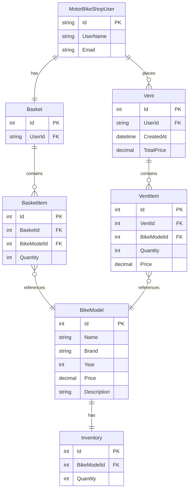

# MotorBikeShop

The purpose of this project is to exercise building web apps using:
  - MS SQL server
  - ASP.NET
    - Entity Framework
    - ASP.NET Identity
  - Unit tests via XUnit

The app also features a client side requests to an API in the search feature.

Although the functionality is not that large, I obey the ASP.NET dependency injection architecture - MVC, Razor Views, Services, Service Interfaces, DTOs etc.  

## Project layout

/MotorBikeShop - the ASP.Net web app.

/MotorBikeShop.Data - The DbContext, Db Models, Migrations and data seed

/MotorBikeShop.Services - The business logic implemented via services and the service interfaces.

/MotorBikeShop.Tests - Unit tests, Mock of the dependency, In-memory database for tests


The hosting files are located in the root folder

/docker-compose.yaml - the tunnel, app and db containers of the app.

/Dockerfile - the build and host stage of the app container.


## Playbook

### Entity framework commands

```bash
Add-Migration InitialCreate
Update-Database
```

### Docker compose commands

Copy the `.env.example` and change the values, then:

```bash
docker compose build
docker compose up
```

## Database diagram

Entity relationship diagram of the database:



