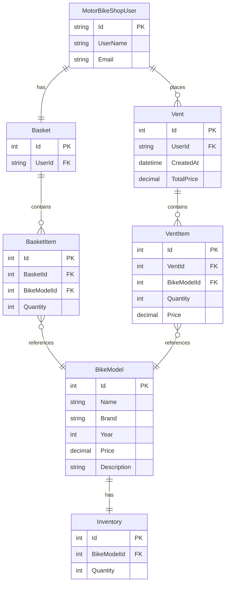

## Playbook
```
Add-Migration InitialCreate
Update-Database
```

Database


```mermaid
erDiagram

    MotorBikeShopUser ||--|| Basket : has
    MotorBikeShopUser ||--o{ Vent : places

    Basket ||--o{ BasketItem : contains
    BasketItem }o--|| BikeModel : references

    Vent ||--o{ VentItem : contains
    VentItem }o--|| BikeModel : references

    BikeModel ||--|| Inventory : has

    MotorBikeShopUser {
        string Id PK
        string UserName
        string Email
    }

    Basket {
        int Id PK
        string UserId FK
    }

    BasketItem {
        int Id PK
        int BasketId FK
        int BikeModelId FK
        int Quantity
    }

    BikeModel {
        int Id PK
        string Name
        string Brand
        int Year
        decimal Price
        string Description
    }

    Inventory {
        int Id PK
        int BikeModelId FK
        int Quantity
    }

    Vent {
        int Id PK
        string UserId FK
        datetime CreatedAt
        decimal TotalPrice
    }

    VentItem {
        int Id PK
        int VentId FK
        int BikeModelId FK
        int Quantity
        decimal Price
    }
```
